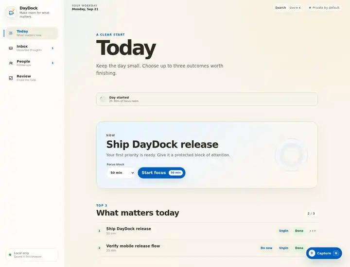

# DayDock

**A calm, local-first workday command center for deciding what matters now.**

DayDock helps knowledge workers capture commitments, choose a small set of outcomes, protect focus time, keep follow-ups visible, and close the day without turning productivity into a score.

**Capture → Decide → Focus → Follow up → Review**

[**Live demo**](https://mykoladotsenko.github.io/daydock/) · [Architecture](./ARCHITECTURE.md) · [UX flow](./docs/UX_FLOW.md) · [Design system](./docs/DESIGN_SYSTEM.md)

Current mature Today workspace · captured from the release Visual Smoke suite.

## Why DayDock exists

Most task apps are good at storing work. DayDock is designed around a harder problem: **reducing repeated decisions during the day**.

It keeps capture intentionally fast, separates collection from prioritization, limits daily priorities to a Top 3, makes one outcome explicitly current, and gives unfinished work a trusted place to return later.

There are no streaks, leaderboards, productivity scores, or artificial overdue pressure.

## Core workflow

| Stage | What DayDock does |
| --- | --- |
| **Capture** | One-field Quick Capture, keyboard shortcut, installed-app shortcut, and PWA Share Target |
| **Decide** | Triage work into Today, Later, Done, or a future Ready again date |
| **Focus** | Protect up to three outcomes, choose what is **Now**, and run resilient focus sessions |
| **Follow up** | Keep lightweight people context, linked tasks, and follow-up dates visible |
| **Review** | See completed work, unresolved work, focus history, and a seven-day rhythm |

## Product highlights

- **Top 3 + Now** — daily priorities stay small, while the current outcome can be promoted without rebuilding the day
- **Calm Later scheduling** — Tomorrow, Next week, custom date, Someday, and automatic resurfacing
- **Recurring work** — Daily, Weekdays, Weekly, and Monthly recurrence without corrupting completion history
- **Focus Mode** — pause/resume/complete with timestamp-derived timing that survives tab throttling
- **Calendar Awareness** — local .ics import, configurable workday, busy-time analysis, and derived focus windows
- **People follow-ups** — lightweight relationship context without turning DayDock into a CRM
- **Command Palette** — Ctrl/Cmd + K search with exact task/person reveal
- **Safe recovery** — validated backup/restore plus structural Undo for task/person removal
- **Local-first PWA** — offline shell, installability, cross-tab sync, and optional Ready again alerts
- **Accessible by design** — semantic HTML, keyboard flows, reduced-motion, forced-colors, native Dialog and Popover APIs

## Engineering highlights

DayDock is intentionally small in runtime dependencies but serious about state integrity and release quality.

- deterministic domain reducer with ids, timestamps, storage, and browser APIs kept outside business logic
- one canonical workspace state consumed through useSyncExternalStore
- schema-versioned persistence with Zod validation, migration, normalization, and safe recovery
- validated BroadcastChannel synchronization with deterministic last-write-wins ordering
- portable backup format separate from raw localStorage representation
- custom ICS parsing and recurrence expansion behind a normalized calendar boundary
- timestamp-based focus timing instead of decrementing canonical seconds
- build-generated, repository-scope-aware service-worker precache
- GitHub Pages artifact verification that rejects invalid deployment paths before release
- desktop, mobile, narrow-mobile, focus, overlay, recovery, and offline visual smoke coverage

## Architecture

~~~text
React feature surfaces
        │
        ▼
useSyncExternalStore
        │
        ▼
DayDock external store
        │
        ├── versioned persistence + migrations
        ├── BroadcastChannel synchronization
        ├── backup / restore
        └── calendar input boundary
        │
        ▼
pure domain reducer
        │
        ├── task + recurrence invariants
        ├── Top 3 / Now
        ├── focus lifecycle
        ├── people relationships
        └── derived selectors / review insights
~~~

The reducer does not generate ids, read the clock, access storage, or call browser APIs. Persisted and imported data is treated as untrusted input and validated before it becomes canonical application state.

For the deeper design rationale, see [ARCHITECTURE.md](./ARCHITECTURE.md).

## Stack

| Layer | Technology |
| --- | --- |
| UI | React 19.3, semantic HTML |
| Language | strict TypeScript 6 |
| Validation | Zod 4 |
| Build | Vite 8.3 |
| Styling | modern CSS, OKLCH, container queries, progressive View Transitions |
| Browser platform | Web Storage, BroadcastChannel, Dialog, Popover, Service Worker, Web App Manifest |
| Tests | Vitest, Testing Library |
| Quality | ESLint 10, TypeScript compiler |
| CI/CD | GitHub Actions, GitHub Pages |

Runtime dependencies are intentionally limited to **React, React DOM, and Zod**.

## Reliability and release gates

Every release is expected to pass:

- lint with zero warnings
- strict TypeScript checking
- unit and component tests
- standard production build
- GitHub Pages-specific artifact verification
- visual smoke across desktop/mobile and critical interaction states
- warmed-profile offline reopening
- repository-scope checks for manifest, JS, CSS, and service worker assets

The Pages build explicitly fails if emitted assets escape /daydock/ or if the legacy repository path reappears.

See [docs/RELEASE_QA.md](./docs/RELEASE_QA.md) for the full release contract.

## Run locally

Requires Node.js 24+.

~~~bash
npm ci
npm run dev
~~~

Run the full quality gate:

~~~bash
npm run check
~~~

Verify the GitHub Pages artifact:

~~~bash
npm run build:pages
~~~

## Code tour

If you are reviewing DayDock technically, start here:

1. [src/domain/daydock/reducer.ts](./src/domain/daydock/reducer.ts) — deterministic domain transitions and invariants
2. [src/storage/dayDockPersistence.ts](./src/storage/dayDockPersistence.ts) — schema validation, migration, and normalization
3. [src/store/synchronizedDayDockStore.ts](./src/store/synchronizedDayDockStore.ts) — cross-tab ordering and failure isolation
4. [src/domain/calendar/ics.ts](./src/domain/calendar/ics.ts) — local calendar parsing and recurrence handling
5. [src/features/focus/FocusMode.tsx](./src/features/focus/FocusMode.tsx) — resilient focus workflow
6. [src/App.test.tsx](./src/App.test.tsx) — user-level component journeys
7. [.github/workflows/visual-smoke.yml](./.github/workflows/visual-smoke.yml) — release visual/offline evidence
8. [scripts/verify-pages-build.mjs](./scripts/verify-pages-build.mjs) — deployment-path regression guard

## Privacy and product boundaries

DayDock requires no account and has no application backend. Workspace data stays in the browser by default, backup export is generated client-side, and imported backups are validated before they can replace current state.

Calendar Awareness is a local snapshot from imported .ics data, not a live calendar connection. Ready again system alerts are also intentionally honest about browser permission and background-delivery limitations.
